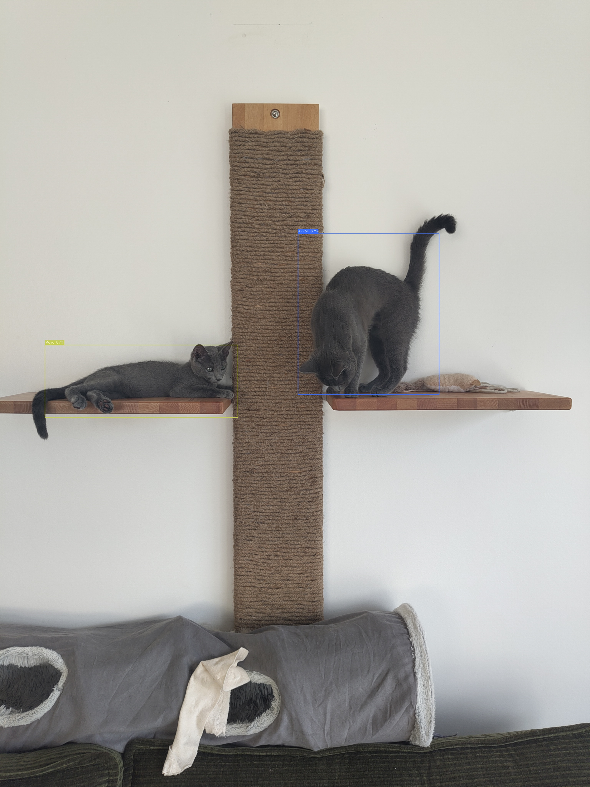

# CatDetection

A fully local machine learning pipeline that detects and identifies two cats — **Aïoli** and **Mayo** — by name in photos. Built with fine-tuned YOLOv8 and served through a browser-based Gradio app.

This project has two stories: the cat detector itself, and the process of building it almost entirely through AI agent collaboration.

---

## Part 1 — The Cat Detection Pipeline

### What it does

Upload a photo and the model draws a bounding box around each cat it finds, labels it by name, and shows a confidence score. It handles 0, 1, or 2 detections per image gracefully.

### Demo



*Aïoli (orange box, left) and Mayo (teal box, right) detected on their wall shelf. Confidence scores are shown on the box labels.*

### Model performance

The model was fine-tuned on 255 personally annotated photos (173 Aïoli appearances, 174 Mayo appearances), expanded to 2091 training images via offline augmentation. Key metrics from the validation set:

| Metric | Value |
|--------|-------|
| mAP@0.5 (val, peak Stage 1) | 0.758 |
| mAP@0.5 (val, peak Stage 2) | 0.748 |
| Primary weakness | Missed detections at threshold 0.5 |

The model identifies each cat correctly when it does detect — the main failure mode is conservatism (under-predicting) rather than wrong labels. Lowering the confidence threshold slider in the GUI recovers most missed detections.

### Architecture

```
data/               Raw photos → YOLO labels → augmented train/val/test splits
src/
  annotate.py       Interactive bounding box annotation session
  preprocess.py     Resize, augment (8–10×), stratified split, data.yaml
  train.py          Two-stage YOLOv8 fine-tuning (frozen backbone → full)
  infer.py          Model loading, inference, bounding box drawing
  evaluate.py       Metrics, IoU matching, failure categorisation
  utils.py          Shared constants, logging, bbox utilities
app/gui.py          Gradio inference app (browser-based)
notebooks/
  01_annotate.ipynb     Interactive annotation tool
  02_training_results.ipynb  Training curves, metrics, failure gallery
```

### Quick start

```bash
# 1. Create and activate the environment
conda create -n catdetection python=3.11 -y
conda activate catdetection

# 2. Install PyTorch with CUDA FIRST (replace cu128 with your CUDA version)
pip install torch torchvision --index-url https://download.pytorch.org/whl/cu128

# 3. Install project dependencies
pip install -r requirements.txt

# 4. Launch the inference app
python app/gui.py
```

> See [TUTORIAL.md](TUTORIAL.md) for a complete walkthrough — annotation, preprocessing, training, evaluation, and common gotchas.

### Training your own model

```python
from src.preprocess import run_preprocessing
from src.train import run_training
from pathlib import Path

# Preprocess annotated photos
run_preprocessing(Path('data/raw'), Path('data/labels'), Path('data'))

# Fine-tune (two-stage: frozen backbone → full)
result = run_training()
print(result.best_weights)  # path to best.pt → use this for inference
```

---

## Part 2 — Building with AI Agents

This project was built almost entirely through iterative collaboration with Claude (Anthropic's AI agent), from initial planning through to the finished Gradio app, test suite, and documentation. The code, documentation, and project structure were all produced in agent sessions — the human role was direction, feedback, and domain knowledge (which cat is which).

### Why this matters

Modern AI agents can do more than autocomplete code. With the right workflow, they can own entire phases of a project: designing architecture, implementing modules, writing tests, debugging failures, and maintaining documentation — while the human focuses on what they actually want to build.

This project was an experiment in that workflow. The result: a fully functional ML pipeline built in a fraction of the time it would have taken manually, with consistent code standards, thorough test coverage, and structured documentation — all from a starting point of three bullet points.

### The workflow that worked

**1. Start with a stub, not a spec**

The initial `plan.md` had three lines. Rather than writing a full specification upfront (which takes as long as building the thing), the agent was asked to read it, identify what was underspecified, and ask clarifying questions before writing anything. This front-loaded the structural decisions without wasting effort on details that would change.

**2. Ask before acting**

The agent grouped open questions and presented them as multiple-choice options — model choice, annotation approach, GUI framework, data source. This one step prevented several dead ends (e.g. building a video pipeline when only photos existed).

**3. Use reference projects as anchors**

Pointing the agent to a real reference project ([ChickenDetection](https://github.com/DennisFaucher/ChickenDetection)) gave it a concrete artifact to reason from. It extracted the transferable decisions (two-stage fine-tuning, YOLO label format, annotation workflow) and modernised the stack without needing to redesign from scratch.

**4. AGENTS.md files as persistent agent memory**

Every folder in the project contains an `AGENTS.md` file describing its purpose, conventions, and current status. This means a new agent session can be oriented instantly by reading the relevant file — no replaying the full conversation history. The root `design_decisions.md` records every architectural decision and why it was made, serving the same purpose at project level.

**5. Iterative refinement, not waterfall**

Each agent session built on the last: annotation → preprocessing → training → evaluation → GUI → documentation → git. Each phase started by reading the relevant `AGENTS.md` and checking the milestone status in `ROADMAP.md`. Decisions made in earlier phases were never relitigated — they were already in the documentation.

**6. Push back**

Agents improve plans faster when challenged. "Why fine-tune instead of training from scratch?" produced a clearer justification and surfaced the compute constraints early. Asking "is anything missing?" at the end of planning sessions reliably caught gaps.

### What this looks like in practice

The full development log is preserved in [`design_decisions.md`](design_decisions.md). Every decision — from annotation UI choice to CUDA install order to test mocking strategy — is recorded with the trigger, the reasoning, and a summary of the agent exchange that produced it. This document is the project's institutional memory.

### Lessons learned

- **Constraints given upfront narrow the solution space fast.** "Local only, Python only, no video" eliminated entire categories of tools before a single line was written.
- **Structured documentation pays compound interest.** Time spent on `ROADMAP.md`, `DESIGN.md`, and `CONTRIBUTING.md` at the start meant every subsequent agent session started oriented rather than confused.
- **The agent is a collaborator, not an oracle.** It makes mistakes, misses edge cases, and sometimes needs to be corrected. The value is in the speed of iteration, not infallibility.
- **Boring infrastructure first.** Getting `pyproject.toml`, `.gitignore`, conda environment, and test scaffolding right in Phase 0 meant the rest of the project never had to stop for tooling problems.

---

## Project status

| Phase | Description | Status |
|-------|-------------|--------|
| 0 | Setup, utils, annotation notebook | ✅ Complete |
| 1 | Photo annotation (255 images) | ✅ Complete |
| 2 | Preprocessing & augmentation | ✅ Complete |
| 3 | Two-stage YOLOv8 fine-tuning | ✅ Complete |
| 4 | Evaluation & results notebook | ✅ Complete |
| 5 | Gradio inference app | ✅ Complete |
| 6 | CLI (`cli.py` subcommands) | 🔜 Next |

## Key documents

| File | Purpose |
|------|---------|
| [TUTORIAL.md](TUTORIAL.md) | Step-by-step onboarding guide for new users |
| [ROADMAP.md](ROADMAP.md) | Goals, state-of-the-art context, phase milestones |
| [DESIGN.md](DESIGN.md) | UX, visual style, naming, interface behaviour |
| [CONTRIBUTING.md](CONTRIBUTING.md) | Architecture, code standards, git conventions |
| [design_decisions.md](design_decisions.md) | Full log of every decision made and why |
